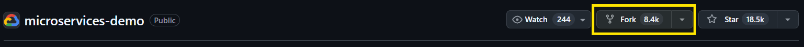
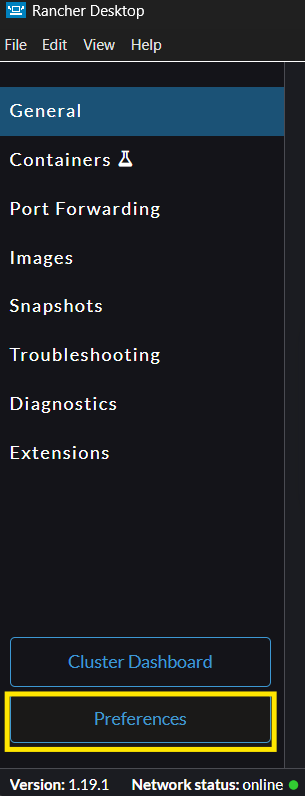
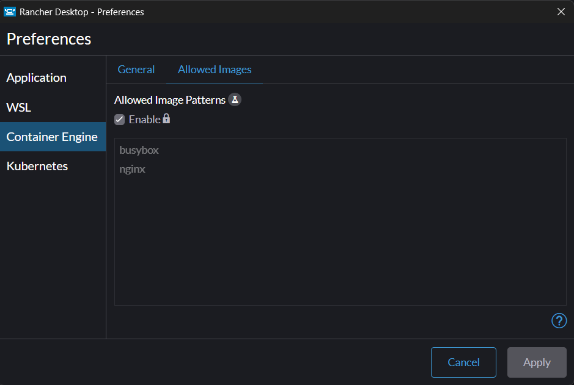
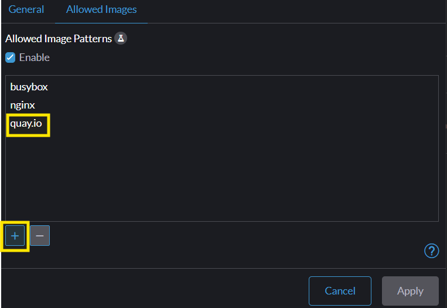
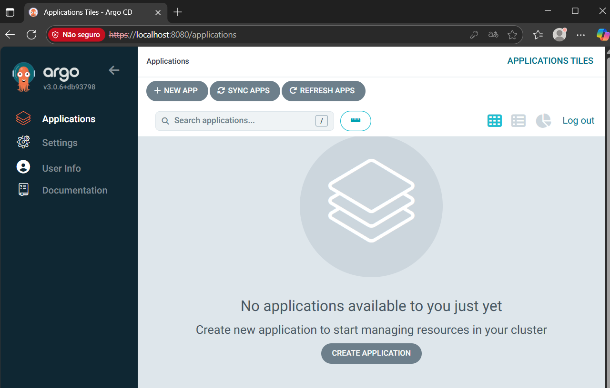
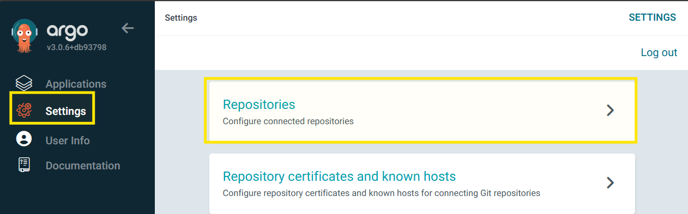

Atenção:
Este repositório é tirado do repositório original [GoogleCloudPlataform/microservices-demo](https://github.com/GoogleCloudPlataform/microservices-demo). Para criar um fork do repositório original, siga para este [passo]()

# O projeto
Este repositório consta o estudo aplicado a um microserviço utilizando o argoCD. O projeto se divide em:
[Introdução](#introdução)
[Pré requisitos](#pré-requisitos)
[Instalando os pré requisitos](#instalando-os-pre-requisitos)
[Criando um fork](#criando-um-fork)
[Instalando o ArgoCD no cluster](#instalando-o-argocd-no-cluster)
[Acessando o ArgoCD](#acessando-o-argocd)
[Criar o App no ArgoCD](#criar-o-app-no-argocd)
[Acessar o frontend](#acessar-o-frontend)

# Introdução
Este repositório tem como objetivo demonstrar a implementação de um microserviço utilizando o ArgoCD para gerenciamento de entrega contínua. O ArgoCD é uma ferramenta poderosa que permite a implementação de práticas GitOps em ambientes Kubernetes, facilitando a automação e o controle de versões das aplicações.
# Pré requisitos
- Rancher Desktop
- Kubectl
- ArgoCD
- Conta no GitHub com repositório público
- Git instalado
- Docker

# Instalando os pré requisitos
## Rancher Desktop, kubectl e docker
Para instalar o Rancher Desktop, siga as instruções no [site oficial](https://rancherdesktop.io). Instale a versão correta para seus sistema operacional e siga atentamente as instruções de instalação, pois o passo de instalar o Kubernetes é fundamental para o funcionamento do ArgoCD. Uma vez instalado o rancher verifique se o kubectl e o docker estão funcionando corretamente utilizando o comando:

```bash
kubectl get nodes
```

```bash
docker --version
```

Caso os comandos não retornem erros, significa que o Rancher Desktop, kubectl e Docker estão instalados corretamente.

## Git
Para instalar o Git, siga as instruções no [site oficial](https://git-scm.com/downloads). Após a instalação, verifique se o Git está funcionando corretamente utilizando o comando:

```bash
git --version
```

Caso o comando retorne a versão do Git, significa que ele está instalado corretamente.

## ArgoCD
Este processo será realizado [neste passo](#instalando-o-argocd-no-cluster).

# Criando um fork
## Criando o fork
Existem diversas formas de criar um fork de um repositório. Primeiramente, acesse o seu github, ou crie sua conta, e após isto acesse o [repositório original](https://github.com/GoogleCloudPlatform/microservices-demo).
Clique no botão "Fork" localizado no canto superior direito da página do repositório. Isso criará uma cópia do repositório original na sua conta do GitHub.


A mais simples porém que necessita de mais afinidade com o prompt de comando / terminal é usar os comandos:
```bash
git clone https://github.com/SEU_USUARIO/NOME_DO_REPOSITORIO
cd microservices-demo
git remote add upstream https://github.com/USUARIO_ORIGINAL/NOME_DO_REPOSITORIO
```
Assim você poderá realizar o próximo passo.

## Criando um novo repositório
É possível criar um novo repositório e copiando o arquivo manifesto YAML necessario para a prática realizando os seguintes comando:
```bash
mkdir <nome_do_novo_repositorio>
cd <nome_do_novo_repositorio>
git init
mkdir gitops-microservice/k8s
cp <caminho_do_diretorio_release>/kubernets_manifest.yaml .<nome_do_repositorio>/gitops-microservice/k8s/online-boutique.yaml
git add .
git commit -m "Adicionando o manifesto do microserviço"
git remote add origin <url_do_seu_repositorio>
git push -u origin main
```

Seu novo repositório será criado e apto para ser utilizado no ArgoCD.
# Instalando o ArgoCD no cluster
Para instalar o ArgoCD no cluster Kubernetes, execute os seguintes comandos:

```bash
kubectl create namespace argocd
kubectl apply -n argocd -f https://raw.githubusercontent.com/argoproj/argo-cd/stable/manifests/install.yaml
```
Isso criará um namespace chamado `argocd` e aplicará os manifests necessários para instalar o ArgoCD no cluster.

# Acessando o ArgoCD
Para acessar o ArgoCD, você precisará expor o serviço do ArgoCD para fora do cluster. Execute o seguinte comando:

```bash
kubectl port-forward svc/argocd-server -n argocd 8080:443
```

* Caso ocorra o erro `error: unable to forward port because pod is not running. Current status=Pending` siga estes passos:
Abra o Rancher Desktop e clique em preferences:

Selecione a opção "Container Engine" > "allowed Images".
Caso esteja igual a a imagem abaixo, instale a versão 1.19.1 de acordo com o sistema operacional

adicione a imagem quay.io clicando em (+) e adicionando o nome de acordo com a figura abaixo:

e faça o login no quay.io (crie um usuário no red hat se necessario) usando o codigo
```bash
docker login quay.io
```
faça o processo de port-forward novamente

Caso o prompt de comando/terminal fique realizando a tarefa, o ArgoCD estará acessível em `http://localhost:8080`. Abra o navegador e acesse essa URL.

Abra uma nova aba de prompt/terminal e digite o comando
```bash
kubectl -n argocd get secret argocd-initial-admin-secret -o jsonpath="{.data.password}" | base64 -d
```

ou 
```powershell
$base64String =kubectl -n argocd get secret argocd-initial-admin-secret -o jsonpath="{.data.password}"
```
e após isto
```powershell
[System.Text.Encoding]::UTF8.GetString([System.Convert]::FromBase64String($base64String))
```
para obter a senha inicial do usuário `admin`. Use `admin` como nome de usuário e a senha obtida no comando acima para fazer login no ArgoCD.

Caso tudo tenha funcionado corretamente, a tela aparecerá desta maneira:


# Criar o App no ArgoCD

Para criar um novo aplicativo no ArgoCD, siga os seguintes passos:
Clique em "settings" e após isto em "Repositories"

Clique em "Connect Repo"

Preencha os campos com as informações do seu repositório: